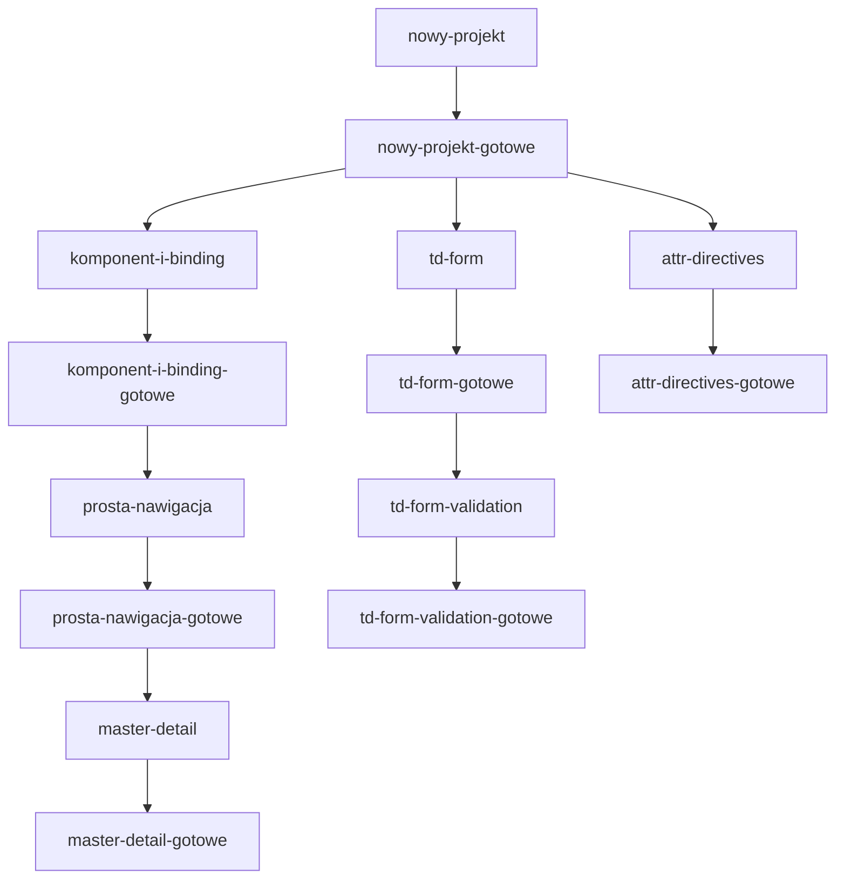

```mermaid
graph TD;

nowy-projekt --> nowy-projekt-gotowe

nowy-projekt-gotowe --> komponent-i-binding
komponent-i-binding --> komponent-i-binding-gotowe

komponent-i-binding-gotowe --> prosta-nawigacja
prosta-nawigacja --> prosta-nawigacja-gotowe

prosta-nawigacja-gotowe --> master-detail
master-detail --> master-detail-gotowe

nowy-projekt-gotowe --> td-form
td-form --> td-form-gotowe

td-form-gotowe --> td-form-validation
td-form-validation --> td-form-validation-gotowe

nowy-projekt-gotowe --> attr-directives
attr-directives --> attr-directives-gotowe

```
